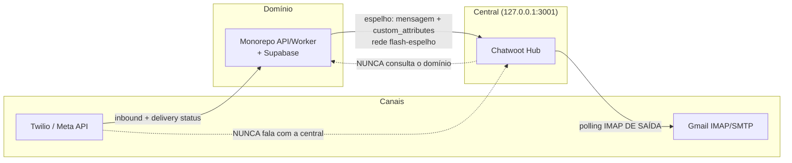
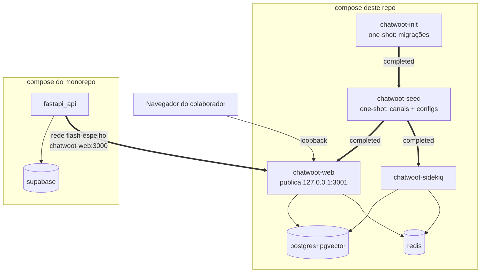
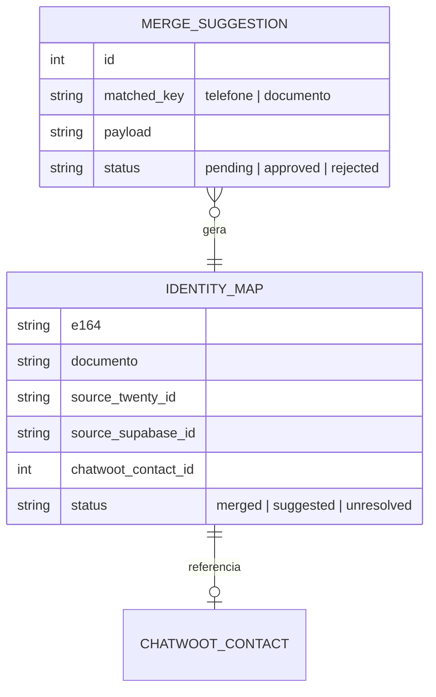

# Architecture Spine — Inbox Flash Capital

## Design Paradigm

**Hub-and-spoke com enriquecimento unidirecional.** O Chatwoot é o **hub** (espelho + cockpit de conversas). Cada canal é um **spoke** conectado por um **provider-adapter** (Twilio, Gmail). O contexto de negócio entra **empurrado pelo domínio no instante do disparo** (AD-13), não por reconciliação posterior. Nenhuma dependência aponta do hub para os bancos de domínio.

Mapa de camadas → responsabilidade:
- **Hub** (Chatwoot): modelo de Conversa/Contato, UI de atendimento, labels, atribuição, relatórios.
- **Adapters** (providers): tradução canal ↔ hub. Plugáveis; trocar provider não muda o modelo de conversa.
- **Domínio** (Twenty, Supabase/monorepo): fontes da verdade de dados de negócio. Emitem eventos; nunca são consultados em runtime pelo hub.

## Invariants & Rules

### AD-1 — Chatwoot é espelho, nunca fonte da verdade de dados de domínio
- **Binds:** all
- **Prevents:** perda de soberania do dado e acoplamento do domínio à central.
- **Rule:** nenhum dado de negócio autoritativo (contato de domínio, contrato, operação, cobrança) é criado ou editado somente na central. A verdade de conversa é do Chatwoot; a verdade de negócio é do Twenty/Supabase.

### AD-2 — Enriquecimento é unidirecional e assíncrono (domínio → central) `[REVISADO 2026-09-02 — ver AD-13]`
- **Binds:** FR-11, FR-12, FR-13, FR-14
- **Prevents:** a central entrar no caminho crítico do domínio.
- **Rule:** o domínio só empurra para o Chatwoot — hoje pelo `chatwoot_mirror.py` do monorepo, no instante do disparo (AD-13). O Chatwoot nunca faz chamada síncrona aos bancos de domínio no caminho de atendimento. Indisponibilidade do domínio degrada o enriquecimento, não o atendimento. **Mas o inverso não vale:** central indisponível perde o evento para sempre (AD-12).

### AD-3 — Identidade de contato por chave dupla E.164 + documento `[REVISADO 2026-09-02 — a regra passa a viver no `chatwoot_mirror.py`; ver AD-13]`
- **Binds:** FR-10, FR-11
- **Prevents:** contatos duplicados e merges errados.
- **Rule:** telefone sempre normalizado para E.164 e documento para dígitos antes de casar. A regra vive no `chatwoot_mirror.py` do monorepo (`_garantir_contato`/`_garantir_conversa`), não num serviço próprio. A **sugestão de merge** para revisão humana era função do Sync e **não existe**: sem ele, o contato é resolvido pelo E.164 do disparo, que é o dado que a Twilio devolve.

### AD-4 — Um número = uma Inbox; provider é adapter plugável
- **Binds:** FR-4, FR-7, FR-9
- **Prevents:** lógica de canal vazando para o hub ou para o domínio.
- **Rule:** cada canal conectado por seu provider (Twilio/Gmail) como uma Inbox distinta. O modelo Conversa/Contato do hub é agnóstico de provider. As inboxes nascem do `chatwoot-seed`, pelos nomes fixos de `INBOX_OFICIAL_NOME` e `INBOX_EMAIL_NOME`.

### AD-5 — Convivência multi-consumidor no número de prospecção sem perda `[SUPERSEDED 2026-09-02 — Evolution removida dos dois repos; ver AD-11]`
- **Binds:** FR-5
- **Prevents:** o agente N8N e o Chatwoot "engolirem" o evento um do outro.
- **Rule:** a instância Evolution permanece no CRM e faz **fan-out** dos eventos (N8N **e** Chatwoot recebem cada mensagem); não é uma fila competida. Entrega at-least-once; consumidores idempotentes.

### AD-6 — Disparo em massa origina no monorepo; central recebe o outbound por push `[ADOPTED]`
- **Binds:** FR-8
- **Prevents:** histórico parcial (só a resposta do cliente) e a central virar motor de campanha.
- **Rule:** o pipeline do monorepo, ao disparar, também registra a mensagem outbound na conversa via API do Chatwoot. A central não origina campanha no MVP.

### AD-7 — Chatwoot Community Edition, sem fork
- **Binds:** all
- **Prevents:** dívida de manutenção de fork e uso indevido de features enterprise.
- **Rule:** imagem oficial (tag fixa), extensão só via API/webhook/automação/atributos custom. Não habilitar features da pasta `enterprise/`.

### AD-8 — Segredos fora do repo; webhooks autenticados; TLS sempre
- **Binds:** all
- **Prevents:** vazamento de credencial e ingestão forjada.
- **Rule:** tokens (Twilio/Chatwoot/Gmail) em `.env`, nunca versionados; lidos por `env_get` sem `source`, para não entrarem no ambiente do processo. Todo webhook valida origem: a assinatura `X-Twilio-Signature` é conferida **no monorepo**, dono do webhook, e o relay para a central leva o `X-Relay-Token`. Enquanto não houver ingresso, o TLS é dispensado porque **não há tráfego externo** — a central só escuta em loopback (AD-10).

### AD-9 — Banco da central isolado dos bancos de domínio
- **Binds:** FR-1
- **Prevents:** acoplamento de dados e risco de blast-radius.
- **Rule:** Postgres próprio do Chatwoot, sem cross-DB com Twenty/Supabase — verificado por `verificar-invariantes.sh` (sem `dblink`/`postgres_fdw`, usuário não-superusuário, nenhuma credencial de banco de domínio no `.env`). O store de identidade próprio do Sync não existe (AD-13).

### AD-10 — Infra é só `docker compose`; nada publica além de loopback `[ACCEPTED 2026-09-02]`
- **Binds:** all
- **Prevents:** camada de indireção (Makefile, Caddyfile) e um porteiro compartilhado entre dois repos.
- **Rule:** um `compose.yaml` na raiz, `.env` na raiz, `scripts/` na raiz. Seed idempotente por
  `rails runner`, encadeado por `service_completed_successfully`; `docker compose up -d --wait` é o
  comando único. **Nenhum serviço publica em `0.0.0.0`** — só `chatwoot-web`, em
  `127.0.0.1:${CHATWOOT_HOST_PORT}` (3001). Sem Makefile, sem Caddy, sem `/etc/hosts`. Quando houver
  ingresso remoto, ele é um `cloudflared` dentro do compose **deste** repo — nunca um proxy
  compartilhado com o CRM.
- **A porta publicada é do NAVEGADOR; a via máquina-a-máquina é rede privada.** A rede
  **`flash-espelho`** tem exatamente dois membros — `fastapi_api` (monorepo) e `chatwoot-web` — e
  nada publicado nela. O CRM não entra: é isso que torna inbox e crm independentes, e é a asserção
  que `verificar-invariantes.sh` cobra.
  **Não substituir por `host.docker.internal`:** medido em 2026-09-02, um bind em `127.0.0.1` recusa
  pacote vindo da bridge do Docker (`172.17.0.1`). E o espelho falha em silêncio (AD-12), então essa
  troca não daria erro — daria um painel com buracos. É também o mesmo formato na VPS e no Railway
  (`chatwoot.railway.internal`).

### AD-11 — A central nunca é site público `[ACCEPTED 2026-09-02]`
- **Binds:** FR-4, FR-6, AD-8
- **Prevents:** expor uma ferramenta interna e herdar a premissa falsa de que a Twilio precisa alcançar
  a central.
- **Rule:** nenhum terceiro alcança o Chatwoot. A Twilio entrega o inbound ao **monorepo**, que valida
  `X-Twilio-Signature` e relaya para `/twilio/callback` com token compartilhado
  (`conectar-twilio.sh:19`, `chatwoot_mirror.py::relay_inbound`); o e-mail entra por **polling IMAP de
  saída** (`trigger_imap_email_inboxes_job`). Sobram dois consumidores: o navegador do colaborador
  (sempre autenticado) e o monorepo (máquina-a-máquina). O `Twilio::CallbackController` **não valida
  assinatura da Twilio**, então o gate do relay é obrigatório em qualquer exposição.

### AD-11.1 — Em loopback, a central LÊ o canal WhatsApp mas não RESPONDE por ele `[MEDIDO 2026-09-02]`
- **Binds:** AD-10, AD-11, STORY-3.2
- **Consequência não prevista do AD-10.** `Channel::TwilioSms#send_message` anexa
  `status_callback` **sem condição**, montado a partir de `FRONTEND_URL`. Com a central em
  `http://localhost:3001`, a Twilio recusa o `messages.create` com **21609** — a mensagem não
  sai. Não há toggle; omitir exigiria fork (proibido, AD-7).
- **Rule:** enquanto não houver ingresso público estável, a central é **painel de leitura** no
  WhatsApp: espelho entra, inbound entra, resposta sai pelo monorepo. O e-mail não é afetado
  (SMTP não tem status callback).
- **Destrava com:** Fase 4. E `FRONTEND_URL` também governa o redirect do OAuth do Gmail —
  trocar exige recadastrar no Google Cloud e refazer o consent.

### AD-12 — O painel é tão completo quanto o uptime de quem o alimenta `[ACCEPTED 2026-09-02]`
- **Binds:** FR-8, AD-6
- **Prevents:** a equipe de cobrança confiar num painel com buracos silenciosos.
- **Rule:** `chatwoot_mirror.py` **não tem retry, fila nem backfill** — a falha é logada e descartada, e
  nenhum job reconcilia depois. Em produção o espelho sai do Railway. Logo **cada minuto com a central
  inalcançável é um buraco permanente**, não um atraso. Decidir onde a central roda é decidir a
  completude do painel. Enquanto a central rodar em máquina de disponibilidade não-garantida, o painel é
  declarado **amostral** por escrito, na UI e no runbook.

### AD-13 — Sem Serviço de Sync: o contexto é carimbado no instante do disparo `[ACCEPTED 2026-09-02]`
- **Binds:** FR-11..FR-14 (anulados), STORY-4.2
- **Prevents:** construir reconciliação posterior para um dado que já está na mão.
- **Rule:** **EPIC-5 cancelado.** O monorepo já conhece `titulo_id`, CNPJ, valor e dias de atraso no
  instante do disparo; esse contexto vai nos `custom_attributes` da conversa. Push unidirecional no
  momento do disparo em vez de reconciliação. A central continua sem consultar banco de domínio em
  runtime — o espírito do AD-2 é preservado sem o serviço que ele pressupunha.
- **Como, e por que não do jeito óbvio:** o carimbo é uma etapa **separada**
  (`chatwoot_mirror.py::_carimbar_atributos`), chamada depois que `conversa_id` foi resolvido —
  **não** dentro de `_garantir_conversa`. Aquele método tem duas saídas, reuso e criação, e o reuso
  é o caminho comum (um sacado em cobrança já tem thread). Pôr os atributos no corpo do POST de
  criação passaria no teste e não carimbaria nada em produção.
- **O endpoint substitui, não mescla:** `POST /conversations/{id}/custom_attributes` faz
  `conversation.custom_attributes = params[...]`. Cada carimbo manda o conjunto completo, e um
  disparo que não conhece um campo o apaga. É deliberado: num painel de cobrança, dado ausente é
  melhor que `dias_atraso` de três meses atrás.

### Diagrama de direção de dependência (quem pode depender de quem)



Duas coisas que o desenho torna óbvias e que decidem o resto:

1. **Nenhum terceiro alcança a central.** A Twilio entrega ao monorepo (que valida
   `X-Twilio-Signature` e faz o relay); o e-mail entra por polling **de saída**. Sobram dois
   consumidores: o navegador do colaborador e o monorepo (AD-11).
2. **A seta do espelho não tem volta nem retry.** Falhou, o evento se perde (AD-12).

## Consistency Conventions

| Concern | Convention |
| --- | --- |
| Naming (labels) | kebab-case, **dicionário fechado** do Glossário do PRD (`lead-frio`, `lead-qualificado`, `cliente-ativo`, `em-cobranca`, `regua-etapa-N`, `inadimplente`, `nao-identificado`). Sem sinônimos. |
| Naming (atributos custom) | snake_case: `cnpj`, `cpf`, `status_operacao`, `dias_atraso`, `valor_em_aberto`, `origem`, `link_twenty`, `link_supabase`, `source_twenty_id`, `source_supabase_id`. |
| Naming (inboxes) | fixos: `WhatsApp Oficial`, `E-mail`. |
| Data & formats | telefone E.164; documento = só dígitos para casar; timestamps UTC; ids de origem guardados como atributos `source_*_id` para link reverso. |
| State & cross-cutting | enriquecimento **idempotente** (upsert por identidade); retry com backoff exponencial em falha transitória; auth por token; toda config por env; logs estruturados por serviço. |

## Stack

| Name | Version |
| --- | --- |
| Chatwoot (Community Edition) | **`v4.15.1-ce`** — fixada em `.env` (`CHATWOOT_TAG`); upgrade em `docs/runbook-upgrade.md` |
| PostgreSQL (com pgvector) | **`pgvector/pgvector:0.8.5-pg16`** |
| Redis | **`7.4.9-alpine`** |
| Twilio WhatsApp (Meta API, existente no monorepo) | provider atual |
| Gmail | IMAP/SMTP com OAuth (XOAUTH2) |
| Docker Compose | v2 — sem Makefile, sem proxy, sem serviço próprio (AD-10, AD-13) |


## Structural Seed

### Visão de containers (deployment)



**As setas grossas são as duas que quebram calado.** A cadeia
`init → seed → web/sidekiq` é `service_completed_successfully`: se o seed falhar, a stack não sobe —
e é assim que se quer, porque um Chatwoot sem as inboxes aceitaria o espelho e o jogaria fora. A
`flash-espelho` tem **dois** membros e nada publicado; a porta em `127.0.0.1` é do navegador e
**não** é alcançável de dentro de container.

### Ambientes
- **staging** e **produção** com a mesma composição; upgrades de versão do Chatwoot validados em staging antes de produção (FR-2).
- Segredos por ambiente em `.env` fora do repo (AD-8).

### Modelo de entidade da central

A central usa **só** o Contact/Conversation/Message do próprio Chatwoot. Não há store de identidade
próprio: o monorepo conhece `titulo_id`, CNPJ, valor e dias de atraso **no instante do disparo** e
carimba tudo nos `custom_attributes` da conversa em `chatwoot_mirror.py::_garantir_conversa` (AD-13).



### Árvore de fonte (repo `inbox-flash-capital`)

Estado as-built em 2026-09-02, depois da Fase 1 (a marca diz o que **existe hoje**):

```text
inbox-flash-capital/
  compose.yaml               # [✔] a stack inteira: postgres, redis, chatwoot-{init,seed,web,sidekiq}
  .env                       # segredos — NUNCA versionado (AD-8)
  .env.example               # [✔] todas as chaves, valores vazios; simetria verificada nos 2 sentidos
  scripts/
    lib/env.sh               # [✔] env_get — lê UMA chave do .env sem dar `source` (segredo fora do ambiente)
    seed/chatwoot_seed.rb    # [✔] rails runner idempotente: as 2 inboxes + installation_configs
    init-db/                 # [1.2] cria usuário, banco e extensões da central (AD-9)
    backup.sh  restore.sh    # [1.4] backup do par banco+anexos; restore em ambiente limpo
    smoke-test.sh            # [1.1] semeia, reinicia e prova a persistência (dev; exige opt-in)
    verificar-invariantes.sh # [1.x] falha se AD-7/8/9/10 forem violados
    retencao-conversas.sh    # [6.3] expurgo LGPD de conversa resolvida antiga
    conectar-twilio.sh       # [3.1] --status e --templates (a inbox já nasce do seed)
    conectar-gmail.sh        # [4.1] --status e --url (o consent do Google é clique humano)
    verificar-canal-oficial.sh  # [3.1] janela 24h, templates, AD-6, RELAY_TOKEN, nada fora da loopback
    verificar-canal-email.sh    # [4.1] provider, IMAP, refresh_token, job do Sidekiq, installation_configs
    backfill-email.sh        # [4.1] recupera e-mail perdido em janela de queda do poller
  docs/                      # product-brief, prd, architecture, epics + runbooks
  .claude/                   # scaffold de dev: hooks, comandos, memories, skills
  CLAUDE.md  PROGRESS.md  README.md
```

> O espelho do canal oficial (STORY-3.2) **não mora aqui** — é código do `monorepo-flash-capital`
> (`api/integrations/chatwoot/chatwoot_mirror.py`), porque quem é dono do webhook do Twilio e do
> motor de disparo é o monorepo (AD-6). Estado: branch **`feat/espelho-chatwoot`** (`c3d5438`),
> **ainda não mergeada na `main` de lá** — até o merge+deploy, o espelho não roda em produção.

## Capability → Architecture Map

| Capability / Área | Lives in | Governed by |
| --- | --- | --- |
| Deploy/backup/versão (FR-1..3) | a raiz do repo + Chatwoot | AD-7, AD-8, AD-9 |
| WhatsApp Oficial (FR-7, FR-8) | Twilio → Chatwoot; monorepo push | AD-4, AD-6 |
| E-mail (FR-9, FR-10) | Gmail → Chatwoot | AD-4, AD-3 |
| ~~Enriquecimento (FR-11..14)~~ | **anulado** — `chatwoot_mirror.py` do monorepo carimba no disparo | **AD-13** |
| Operação (FR-15, FR-16) | Chatwoot nativo | AD-7 |

## Deferred

- **Dashboard App (iframe) com dado ao vivo:** adiada; MVP usa só atributos empurrados (AD-2 mantém a central leve).
- **Sync bidirecional (central → domínio):** adiada; MVP é unidirecional (AD-2).
- **Campanhas/disparo em massa na central:** adiada; permanece no monorepo (AD-6).
- **SSO / embed na plataforma interna:** adiada para fase 2.
- **Novos canais (Instagram, webchat, Telegram):** futuro; o paradigma de adapter (AD-4) já os acomoda.
