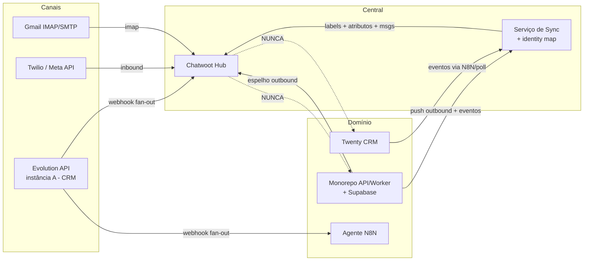
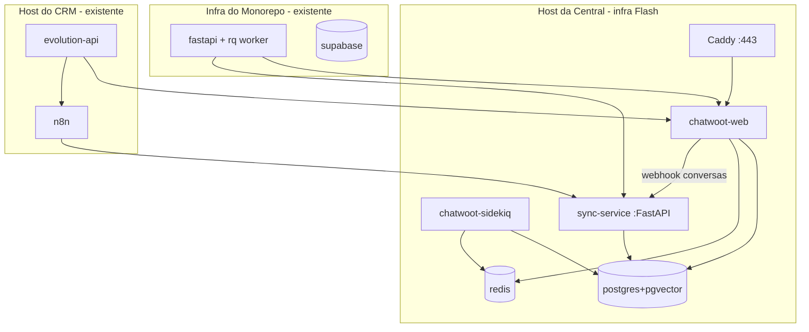
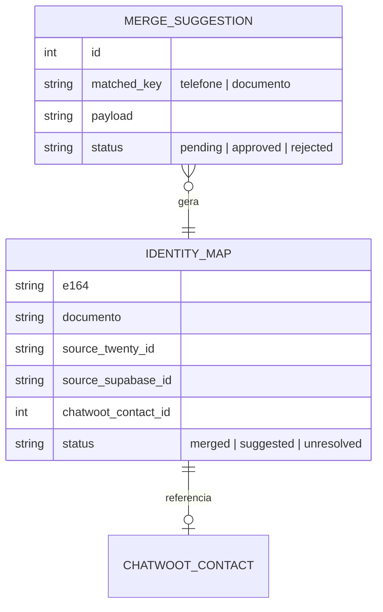

# Architecture Spine — Inbox Flash Capital

## Design Paradigm

**Hub-and-spoke com enriquecimento por eventos unidirecional.** O Chatwoot é o **hub** (espelho + cockpit de conversas). Cada canal é um **spoke** conectado por um **provider-adapter** (Evolution, Twilio, Gmail). O contexto de negócio entra por um **bridge assíncrono e unidirecional** (o Serviço de Sync), que empurra estado a partir dos sistemas de domínio. Nenhuma dependência aponta do hub para os bancos de domínio.

Mapa de camadas → responsabilidade:
- **Hub** (Chatwoot): modelo de Conversa/Contato, UI de atendimento, labels, atribuição, relatórios.
- **Adapters** (providers): tradução canal ↔ hub. Plugáveis; trocar provider não muda o modelo de conversa.
- **Bridge** (Serviço de Sync): resolução de identidade + push de labels/atributos. Único componente construído do zero e o único dono da lógica de reconciliação.
- **Domínio** (Twenty, Supabase/monorepo): fontes da verdade de dados de negócio. Emitem eventos; nunca são consultados em runtime pelo hub.

## Invariants & Rules

### AD-1 — Chatwoot é espelho, nunca fonte da verdade de dados de domínio
- **Binds:** all
- **Prevents:** perda de soberania do dado e acoplamento do domínio à central.
- **Rule:** nenhum dado de negócio autoritativo (contato de domínio, contrato, operação, cobrança) é criado ou editado somente na central. A verdade de conversa é do Chatwoot; a verdade de negócio é do Twenty/Supabase.

### AD-2 — Enriquecimento é unidirecional e assíncrono (domínio → central) `[ADOPTED]`
- **Binds:** FR-11, FR-12, FR-13, FR-14
- **Prevents:** a central entrar no caminho crítico do domínio.
- **Rule:** o Serviço de Sync só empurra para o Chatwoot. O Chatwoot nunca faz chamada síncrona aos bancos de domínio no caminho de atendimento. Indisponibilidade do domínio degrada o enriquecimento, não o atendimento.

### AD-3 — Identidade de contato por chave dupla E.164 + documento `[ADOPTED]`
- **Binds:** FR-10, FR-11
- **Prevents:** contatos duplicados e merges errados.
- **Rule:** telefone sempre normalizado para E.164 e documento para dígitos antes de casar. **Merge automático só quando telefone E documento casam.** Casando só uma chave → cria **sugestão de merge** para revisão humana. O Serviço de Sync é o único lugar onde essa regra vive.

### AD-4 — Um número = uma Inbox; provider é adapter plugável
- **Binds:** FR-4, FR-7, FR-9
- **Prevents:** lógica de canal vazando para o hub ou para o domínio.
- **Rule:** cada canal conectado por seu provider (Evolution/Twilio/Gmail) como uma Inbox distinta. O modelo Conversa/Contato do hub é agnóstico de provider.

### AD-5 — Convivência multi-consumidor no número de prospecção sem perda `[ADOPTED]`
- **Binds:** FR-5
- **Prevents:** o agente N8N e o Chatwoot "engolirem" o evento um do outro.
- **Rule:** a instância Evolution permanece no CRM e faz **fan-out** dos eventos (N8N **e** Chatwoot recebem cada mensagem); não é uma fila competida. Entrega at-least-once; consumidores idempotentes.

### AD-6 — Disparo em massa origina no monorepo; central recebe o outbound por push `[ADOPTED]`
- **Binds:** FR-8
- **Prevents:** histórico parcial (só a resposta do cliente) e a central virar motor de campanha.
- **Rule:** o pipeline do monorepo, ao disparar, também registra a mensagem outbound na conversa via API do Chatwoot. A central não origina campanha no MVP.

### AD-7 — Chatwoot Community Edition, sem fork
- **Binds:** all
- **Prevents:** dívida de manutenção de fork e uso indevido de features enterprise.
- **Rule:** imagem oficial (tag fixa), extensão só via API/webhook/automação/atributos custom. Não habilitar features da pasta `enterprise/`.

### AD-8 — Segredos fora do repo; webhooks autenticados; TLS sempre
- **Binds:** all
- **Prevents:** vazamento de credencial e ingestão forjada.
- **Rule:** tokens (Evolution/Twilio/Chatwoot/Gmail) em `.env`/secret store, nunca versionados. Todo webhook valida origem (assinatura `X-Twilio-Signature` no inbound Twilio; token compartilhado nos webhooks Evolution/Chatwoot). Tráfego externo só via TLS.

### AD-9 — Banco da central isolado dos bancos de domínio
- **Binds:** FR-1
- **Prevents:** acoplamento de dados e risco de blast-radius.
- **Rule:** Postgres próprio do Chatwoot; o Serviço de Sync tem seu próprio store de mapeamento de identidade. Sem cross-DB com Twenty/Supabase.

### Diagrama de direção de dependência (quem pode depender de quem)



## Consistency Conventions

| Concern | Convention |
| --- | --- |
| Naming (labels) | kebab-case, **dicionário fechado** do Glossário do PRD (`lead-frio`, `lead-qualificado`, `cliente-ativo`, `em-cobranca`, `regua-etapa-N`, `inadimplente`, `nao-identificado`). Sem sinônimos. |
| Naming (atributos custom) | snake_case: `cnpj`, `cpf`, `status_operacao`, `dias_atraso`, `valor_em_aberto`, `origem`, `link_twenty`, `link_supabase`, `source_twenty_id`, `source_supabase_id`. |
| Naming (inboxes) | fixos: `WhatsApp Prospecção`, `WhatsApp Oficial`, `E-mail`. |
| Data & formats | telefone E.164; documento = só dígitos para casar; timestamps UTC; ids de origem guardados como atributos `source_*_id` para link reverso. |
| State & cross-cutting | enriquecimento **idempotente** (upsert por identidade); retry com backoff exponencial em falha transitória; auth por token; toda config por env; logs estruturados por serviço. |

## Stack

| Name | Version |
| --- | --- |
| Chatwoot (Community Edition) | **`v4.15.1-ce`** — fixada em `deploy/.env` (`CHATWOOT_TAG`); upgrade em `docs/runbook-upgrade.md` |
| PostgreSQL (com pgvector) | **`pgvector/pgvector:0.8.5-pg16`** |
| Redis | **`7.4.9-alpine`** |
| Caddy (reverse proxy / TLS) | **`2.11.4`** |
| Evolution API (existente no CRM) | v2.3.7 |
| Twilio WhatsApp (Meta API, existente no monorepo) | provider atual |
| Serviço de Sync | Python 3.12 + FastAPI + httpx (alinhado ao monorepo) |

## Structural Seed

### Visão de containers (deployment)



### Ambientes
- **staging** e **produção** com a mesma composição; upgrades de versão do Chatwoot validados em staging antes de produção (FR-2).
- Segredos por ambiente em `.env` fora do repo (AD-8).

### Modelo de entidade da central (lado Sync)
O Chatwoot já possui Contact/Conversation/Message. O Serviço de Sync mantém um **mapa de identidade** próprio (AD-9):



### Árvore de fonte (repo `inbox-flash-capital`)

```text
inbox-flash-capital/
  docs/                      # esta documentação (product-brief, prd, architecture, epics)
  deploy/                    # [EPIC-1 ✔] a stack da central
    docker-compose.yml       # caddy, chatwoot-web, chatwoot-sidekiq, chatwoot-init, postgres, redis
    Caddyfile                # TLS + único ponto de entrada (só ele publica porta)
    .env.example             # todas as chaves; o .env real nunca é versionado
    scripts/
      init-db/               # cria usuário, banco e extensões da central (AD-9)
      backup.sh  restore.sh  # backup do par banco+anexos; restore com ensaio em ambiente limpo
      smoke-test.sh          # semeia, reinicia e prova a persistência (dev/staging)
      verificar-invariantes.sh  # falha se AD-7/AD-8/AD-9 forem violados
      retencao-conversas.sh  # expurgo LGPD de conversa resolvida antiga
  sync-service/              # [EPIC-5] ainda não existe
    app/
      main.py                # FastAPI: webhooks de domínio + Chatwoot
      identity.py            # AD-3: resolução E.164 + documento, merge/sugestão
      chatwoot_client.py     # httpx: contatos, labels, atributos, mensagens
      handlers/              # eventos: twenty, monorepo, chatwoot
      models.py              # identity_map, merge_suggestion
    tests/
  .claude/                   # scaffold de dev: hooks, comandos, memories, skills
  CLAUDE.md  PROGRESS.md  README.md
```

## Capability → Architecture Map

| Capability / Área | Lives in | Governed by |
| --- | --- | --- |
| Deploy/backup/versão (FR-1..3) | `deploy/` + Chatwoot | AD-7, AD-8, AD-9 |
| WhatsApp Prospecção (FR-4..6) | Evolution (CRM) → Chatwoot | AD-4, AD-5 |
| WhatsApp Oficial (FR-7, FR-8) | Twilio → Chatwoot; monorepo push | AD-4, AD-6 |
| E-mail (FR-9, FR-10) | Gmail → Chatwoot | AD-4, AD-3 |
| Enriquecimento (FR-11..14) | `sync-service/` | AD-2, AD-3, AD-9 |
| Operação (FR-15, FR-16) | Chatwoot nativo | AD-7 |

## Deferred

- **Instância B (número de relacionamento):** mesmo padrão do canal de prospecção sem agente; adiada para fase 2 por escopo (baixo esforço, revisar se cronograma permitir).
- **Dashboard App (iframe) com dado ao vivo:** adiada; MVP usa só atributos empurrados (AD-2 mantém a central leve).
- **Sync bidirecional (central → domínio):** adiada; MVP é unidirecional (AD-2).
- **Campanhas/disparo em massa na central:** adiada; permanece no monorepo (AD-6).
- **SSO / embed na plataforma interna:** adiada para fase 2.
- **Novos canais (Instagram, webchat, Telegram):** futuro; o paradigma de adapter (AD-4) já os acomoda.
