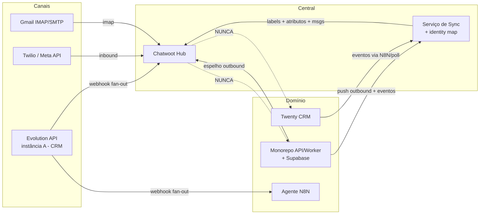
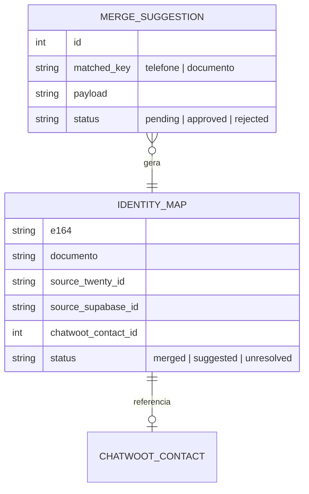

# Architecture Spine — Inbox Flash Capital

> ### ℹ️ COMO LER ESTE DOC — 2026-09-02
>
> As decisões **AD-10..AD-13 são as vigentes**; **AD-5 está SUPERSEDED** e **AD-2/AD-3 REVISADOS**. O resto do documento (diagramas, árvore as-built, tabela de stack) ainda descreve o sistema **como ele é hoje** — com Caddy, Makefile, Evolution e a rede `flash-canais`. Isso é intencional: a reescrita acontece na Fase 1.7, depois que o código mudar. **Enquanto isso: as ADs mandam, o resto descreve.**
>
> Ver **AD-10..AD-13** em `inbox/docs/architecture.md`, **ADR-010** em `crm/docs/07_Decisoes.md`, e o `HANDOFF-espelho-chatwoot.md`.


## Design Paradigm

**Hub-and-spoke com enriquecimento por eventos unidirecional.** O Chatwoot é o **hub** (espelho + cockpit de conversas). Cada canal é um **spoke** conectado por um **provider-adapter** (Evolution, Twilio, Gmail). O contexto de negócio entra por um **bridge assíncrono e unidirecional** (o Serviço de Sync), que empurra estado a partir dos sistemas de domínio. Nenhuma dependência aponta do hub para os bancos de domínio.

Mapa de camadas → responsabilidade:
- **Hub** (Chatwoot): modelo de Conversa/Contato, UI de atendimento, labels, atribuição, relatórios.
- **Adapters** (providers): tradução canal ↔ hub. Plugáveis; trocar provider não muda o modelo de conversa.
- **Bridge** (Serviço de Sync): resolução de identidade + push de labels/atributos. Único componente construído do zero e o único dono da lógica de reconciliação.
- **Domínio** (Twenty, Supabase/monorepo): fontes da verdade de dados de negócio. Emitem eventos; nunca são consultados em runtime pelo hub.

## Invariants & Rules

### AD-1 — Chatwoot é espelho, nunca fonte da verdade de dados de domínio
- **Binds:** all
- **Prevents:** perda de soberania do dado e acoplamento do domínio à central.
- **Rule:** nenhum dado de negócio autoritativo (contato de domínio, contrato, operação, cobrança) é criado ou editado somente na central. A verdade de conversa é do Chatwoot; a verdade de negócio é do Twenty/Supabase.

### AD-2 — Enriquecimento é unidirecional e assíncrono (domínio → central) `[REVISADO 2026-09-02 — ver AD-13]`
- **Binds:** FR-11, FR-12, FR-13, FR-14
- **Prevents:** a central entrar no caminho crítico do domínio.
- **Rule:** o Serviço de Sync só empurra para o Chatwoot. O Chatwoot nunca faz chamada síncrona aos bancos de domínio no caminho de atendimento. Indisponibilidade do domínio degrada o enriquecimento, não o atendimento.

### AD-3 — Identidade de contato por chave dupla E.164 + documento `[REVISADO 2026-09-02 — a regra passa a viver no `chatwoot_mirror.py`; ver AD-13]`
- **Binds:** FR-10, FR-11
- **Prevents:** contatos duplicados e merges errados.
- **Rule:** telefone sempre normalizado para E.164 e documento para dígitos antes de casar. **Merge automático só quando telefone E documento casam.** Casando só uma chave → cria **sugestão de merge** para revisão humana. O Serviço de Sync é o único lugar onde essa regra vive.

### AD-4 — Um número = uma Inbox; provider é adapter plugável
- **Binds:** FR-4, FR-7, FR-9
- **Prevents:** lógica de canal vazando para o hub ou para o domínio.
- **Rule:** cada canal conectado por seu provider (Evolution/Twilio/Gmail) como uma Inbox distinta. O modelo Conversa/Contato do hub é agnóstico de provider.

### AD-5 — Convivência multi-consumidor no número de prospecção sem perda `[SUPERSEDED 2026-09-02 — Evolution removida dos dois repos; ver AD-11]`
- **Binds:** FR-5
- **Prevents:** o agente N8N e o Chatwoot "engolirem" o evento um do outro.
- **Rule:** a instância Evolution permanece no CRM e faz **fan-out** dos eventos (N8N **e** Chatwoot recebem cada mensagem); não é uma fila competida. Entrega at-least-once; consumidores idempotentes.

### AD-6 — Disparo em massa origina no monorepo; central recebe o outbound por push `[ADOPTED]`
- **Binds:** FR-8
- **Prevents:** histórico parcial (só a resposta do cliente) e a central virar motor de campanha.
- **Rule:** o pipeline do monorepo, ao disparar, também registra a mensagem outbound na conversa via API do Chatwoot. A central não origina campanha no MVP.

### AD-7 — Chatwoot Community Edition, sem fork
- **Binds:** all
- **Prevents:** dívida de manutenção de fork e uso indevido de features enterprise.
- **Rule:** imagem oficial (tag fixa), extensão só via API/webhook/automação/atributos custom. Não habilitar features da pasta `enterprise/`.

### AD-8 — Segredos fora do repo; webhooks autenticados; TLS sempre
- **Binds:** all
- **Prevents:** vazamento de credencial e ingestão forjada.
- **Rule:** tokens (Evolution/Twilio/Chatwoot/Gmail) em `.env`/secret store, nunca versionados. Todo webhook valida origem (assinatura `X-Twilio-Signature` no inbound Twilio; token compartilhado nos webhooks Evolution/Chatwoot). Tráfego externo só via TLS.

### AD-9 — Banco da central isolado dos bancos de domínio
- **Binds:** FR-1
- **Prevents:** acoplamento de dados e risco de blast-radius.
- **Rule:** Postgres próprio do Chatwoot; o Serviço de Sync tem seu próprio store de mapeamento de identidade. Sem cross-DB com Twenty/Supabase.

### AD-10 — Infra é só `docker compose`; nada publica além de loopback `[ACCEPTED 2026-09-02]`
- **Binds:** all
- **Prevents:** camada de indireção (Makefile, Caddyfile) e um porteiro compartilhado entre dois repos.
- **Rule:** um `compose.yaml` na raiz, `.env` na raiz, `scripts/` na raiz. Seed idempotente por
  `rails runner`, encadeado por `service_completed_successfully`; `docker compose up -d --wait` é o
  comando único. **Nenhum serviço publica em `0.0.0.0`** — só `chatwoot-web`, em `127.0.0.1:3001`. Sem
  Makefile, sem Caddy, sem `/etc/hosts`, sem a rede `flash-canais`. Quando houver ingresso remoto, ele é
  um `cloudflared` dentro do compose **deste** repo — nunca um proxy compartilhado com o CRM.

### AD-11 — A central nunca é site público `[ACCEPTED 2026-09-02]`
- **Binds:** FR-4, FR-6, AD-8
- **Prevents:** expor uma ferramenta interna e herdar a premissa falsa de que a Twilio precisa alcançar
  a central.
- **Rule:** nenhum terceiro alcança o Chatwoot. A Twilio entrega o inbound ao **monorepo**, que valida
  `X-Twilio-Signature` e relaya para `/twilio/callback` com token compartilhado
  (`conectar-twilio.sh:19`, `chatwoot_mirror.py::relay_inbound`); o e-mail entra por **polling IMAP de
  saída** (`trigger_imap_email_inboxes_job`). Sobram dois consumidores: o navegador do colaborador
  (sempre autenticado) e o monorepo (máquina-a-máquina). O `Twilio::CallbackController` **não valida
  assinatura da Twilio**, então o gate do relay é obrigatório em qualquer exposição.

### AD-12 — O painel é tão completo quanto o uptime de quem o alimenta `[ACCEPTED 2026-09-02]`
- **Binds:** FR-8, AD-6
- **Prevents:** a equipe de cobrança confiar num painel com buracos silenciosos.
- **Rule:** `chatwoot_mirror.py` **não tem retry, fila nem backfill** — a falha é logada e descartada, e
  nenhum job reconcilia depois. Em produção o espelho sai do Railway. Logo **cada minuto com a central
  inalcançável é um buraco permanente**, não um atraso. Decidir onde a central roda é decidir a
  completude do painel. Enquanto a central rodar em máquina de disponibilidade não-garantida, o painel é
  declarado **amostral** por escrito, na UI e no runbook.

### AD-13 — Sem Serviço de Sync: o contexto é carimbado no instante do disparo `[ACCEPTED 2026-09-02]`
- **Binds:** FR-11..FR-14 (anulados), STORY-4.2
- **Prevents:** construir reconciliação posterior para um dado que já está na mão.
- **Rule:** **EPIC-5 cancelado.** O monorepo já conhece `titulo_id`, CNPJ, valor e dias de atraso no
  instante do disparo; esse contexto vai nos `custom_attributes` da conversa, dentro de
  `chatwoot_mirror.py::_garantir_conversa`. Push unidirecional no momento do disparo em vez de
  reconciliação. A central continua sem consultar banco de domínio em runtime — o espírito do AD-2 é
  preservado sem o serviço que ele pressupunha.

### Diagrama de direção de dependência (quem pode depender de quem)



## Consistency Conventions

| Concern | Convention |
| --- | --- |
| Naming (labels) | kebab-case, **dicionário fechado** do Glossário do PRD (`lead-frio`, `lead-qualificado`, `cliente-ativo`, `em-cobranca`, `regua-etapa-N`, `inadimplente`, `nao-identificado`). Sem sinônimos. |
| Naming (atributos custom) | snake_case: `cnpj`, `cpf`, `status_operacao`, `dias_atraso`, `valor_em_aberto`, `origem`, `link_twenty`, `link_supabase`, `source_twenty_id`, `source_supabase_id`. |
| Naming (inboxes) | fixos: `WhatsApp Prospecção`, `WhatsApp Oficial`, `E-mail`. |
| Data & formats | telefone E.164; documento = só dígitos para casar; timestamps UTC; ids de origem guardados como atributos `source_*_id` para link reverso. |
| State & cross-cutting | enriquecimento **idempotente** (upsert por identidade); retry com backoff exponencial em falha transitória; auth por token; toda config por env; logs estruturados por serviço. |

## Stack

| Name | Version |
| --- | --- |
| Chatwoot (Community Edition) | **`v4.15.1-ce`** — fixada em `deploy/.env` (`CHATWOOT_TAG`); upgrade em `docs/runbook-upgrade.md` |
| PostgreSQL (com pgvector) | **`pgvector/pgvector:0.8.5-pg16`** |
| Redis | **`7.4.9-alpine`** |
| Caddy (reverse proxy / TLS) | **`2.11.4`** |
| Evolution API (existente no CRM) | v2.3.7 |
| Twilio WhatsApp (Meta API, existente no monorepo) | provider atual |
| Serviço de Sync | Python 3.12 + FastAPI + httpx (alinhado ao monorepo) |

## Structural Seed

### Visão de containers (deployment)

```mermaid
graph TB
  subgraph HostCentral[Host da Central - infra Flash]
    CADDY[Caddy :443]
    CWWEB[chatwoot-web]
    CWWORKER[chatwoot-sidekiq]
    PG[(postgres+pgvector)]
    RD[(redis)]
    SYNC[sync-service :FastAPI]
    CADDY --> CWWEB
    CWWEB --> PG
    CWWEB --> RD
    CWWORKER --> PG
    CWWORKER --> RD
    SYNC --> PG
  end
  subgraph HostCRM[Host do CRM - existente]
    EVO[evolution-api]
    N8NBOX[n8n]
  end
  subgraph HostMono[Infra do Monorepo - existente]
    APIMONO[fastapi + rq worker]
    SUPA[(supabase)]
  end
  EVO --> CWWEB
  EVO --> N8NBOX
  APIMONO --> CWWEB
  APIMONO --> SYNC
  N8NBOX --> SYNC
  CWWEB -->|webhook conversas| SYNC
```



### Ambientes
- **staging** e **produção** com a mesma composição; upgrades de versão do Chatwoot validados em staging antes de produção (FR-2).
- Segredos por ambiente em `.env` fora do repo (AD-8).

### Modelo de entidade da central (lado Sync)
O Chatwoot já possui Contact/Conversation/Message. O Serviço de Sync mantém um **mapa de identidade** próprio (AD-9):



### Árvore de fonte (repo `inbox-flash-capital`)

Estado as-built (a marca diz o que **existe hoje**, não o que foi planejado):

```text
inbox-flash-capital/
  Makefile                   # [✔] atalhos de operação — `make help` lista todos
  docs/                      # esta documentação (product-brief, prd, architecture, epics) + runbooks
  deploy/                    # [EPIC-1 ✔] a stack da central
    docker-compose.yml       # caddy, chatwoot-web, chatwoot-sidekiq, chatwoot-init, postgres, redis
    Caddyfile                # TLS + único ponto de entrada (só ele publica porta); perfil `edge`
    .env.example             # todas as chaves; o .env real nunca é versionado
    scripts/
      init-db/                    # [1.2] cria usuário, banco e extensões da central (AD-9)
      backup.sh  restore.sh       # [1.4] backup do par banco+anexos; restore em ambiente limpo
      smoke-test.sh               # [1.1] semeia, reinicia e prova a persistência (dev/staging)
      verificar-invariantes.sh    # [1.x] falha se AD-7/AD-8/AD-9 forem violados (`make check`)
      retencao-conversas.sh       # [6.3] expurgo LGPD de conversa resolvida antiga
      conectar-evolution.sh       # [2.1] cria/liga a inbox WhatsApp Prospecção (Evolution)
      verificar-fanout.sh         # [2.2] prova os DOIS consumidores vivos (AD-5)
      dedup-mensagens.sh          # [2.2] faxineiro de duplicata do espelho (replay do Baileys)
      verificar-aquecimento.sh    # [2.3] só-inbound + rampa + zero campanha (AD-6)
      conectar-twilio.sh          # [3.1] cria a inbox WhatsApp Oficial (medium=whatsapp) + templates
      verificar-canal-oficial.sh  # [3.1] janela 24h, templates, AD-6, RELAY_TOKEN
  sync-service/              # [EPIC-5] AINDA NÃO EXISTE — único componente construído do zero (TDD)
    app/
      main.py                # FastAPI: webhooks de domínio + Chatwoot
      identity.py            # AD-3: resolução E.164 + documento, merge/sugestão
      chatwoot_client.py     # httpx: contatos, labels, atributos, mensagens
      handlers/              # eventos: twenty, monorepo, chatwoot
      models.py              # identity_map, merge_suggestion
    tests/
  .claude/                   # scaffold de dev: hooks, comandos, memories, skills
  CLAUDE.md  PROGRESS.md  README.md
```

> O espelho do canal oficial (STORY-3.2) **não mora aqui** — é código do `monorepo-flash-capital`
> (`api/integrations/chatwoot/chatwoot_mirror.py`), porque quem é dono do webhook do Twilio e do
> motor de disparo é o monorepo (AD-6). Estado: branch **`feat/espelho-chatwoot`** (`c3d5438`),
> **ainda não mergeada na `main` de lá** — até o merge+deploy, o espelho não roda em produção.

## Capability → Architecture Map

| Capability / Área | Lives in | Governed by |
| --- | --- | --- |
| Deploy/backup/versão (FR-1..3) | `deploy/` + Chatwoot | AD-7, AD-8, AD-9 |
| WhatsApp Prospecção (FR-4..6) | Evolution (CRM) → Chatwoot | AD-4, AD-5 |
| WhatsApp Oficial (FR-7, FR-8) | Twilio → Chatwoot; monorepo push | AD-4, AD-6 |
| E-mail (FR-9, FR-10) | Gmail → Chatwoot | AD-4, AD-3 |
| Enriquecimento (FR-11..14) | `sync-service/` | AD-2, AD-3, AD-9 |
| Operação (FR-15, FR-16) | Chatwoot nativo | AD-7 |

## Deferred

- **Instância B (número de relacionamento):** mesmo padrão do canal de prospecção sem agente; adiada para fase 2 por escopo (baixo esforço, revisar se cronograma permitir).
- **Dashboard App (iframe) com dado ao vivo:** adiada; MVP usa só atributos empurrados (AD-2 mantém a central leve).
- **Sync bidirecional (central → domínio):** adiada; MVP é unidirecional (AD-2).
- **Campanhas/disparo em massa na central:** adiada; permanece no monorepo (AD-6).
- **SSO / embed na plataforma interna:** adiada para fase 2.
- **Novos canais (Instagram, webchat, Telegram):** futuro; o paradigma de adapter (AD-4) já os acomoda.
